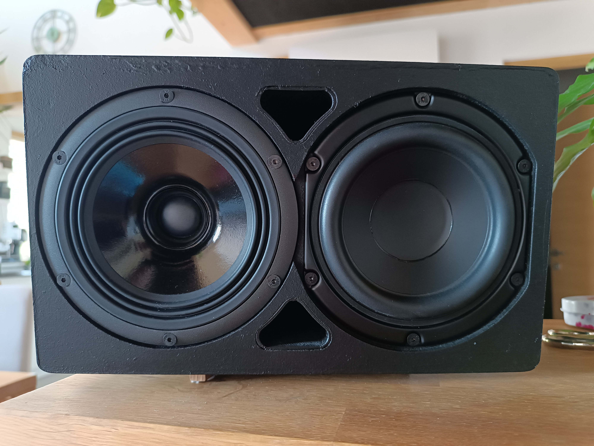
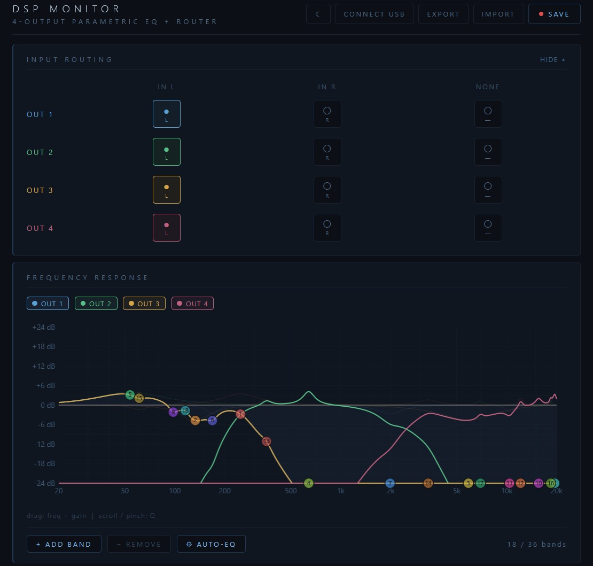
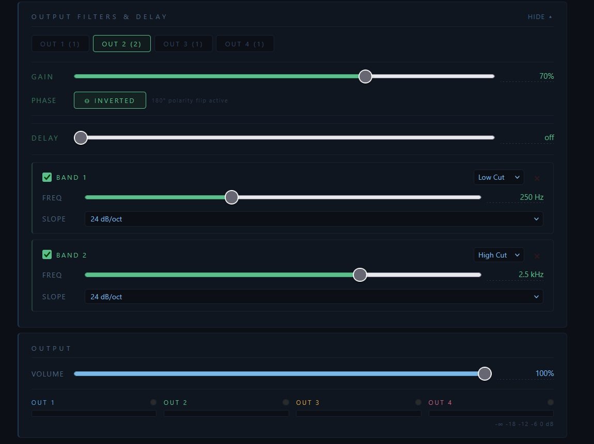
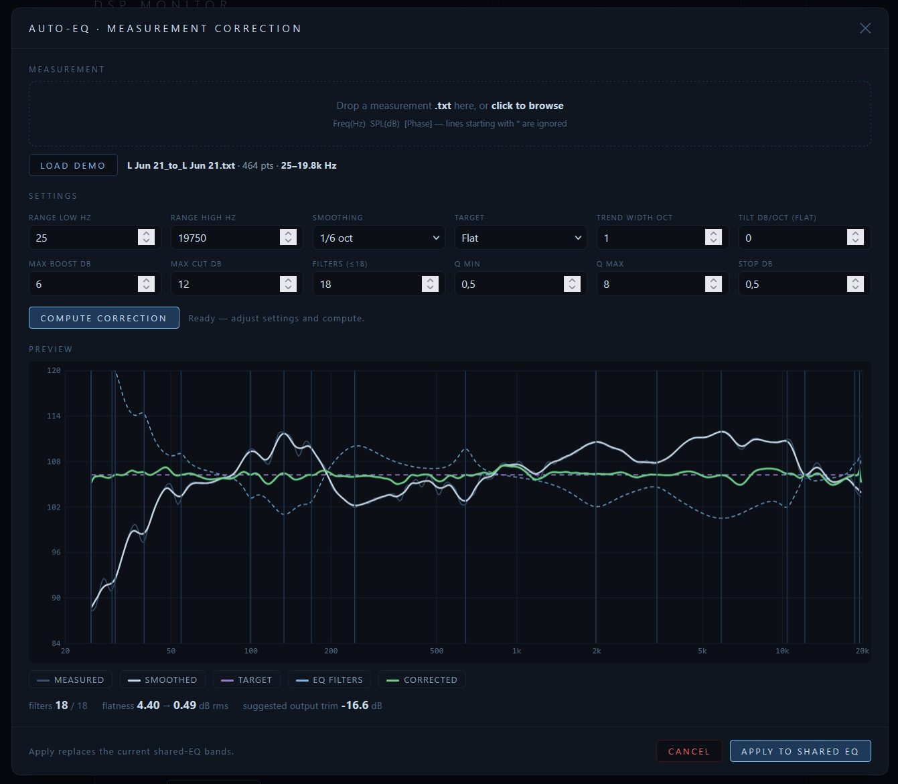

# Nearfield Monitor with ESP32-DSP-4x50W-Amplifier
This project is studio monitor with a DSP amplifier board, based on an esp32-S3.

A 2 channel ADC converts the incoming Differential signals to an I2S stream, the ESP32S3 then acts as DSP and splits the I2S stream to 2 Amplifier chips with digital input, so they are also the DAC.
There are 2 different versions of the firmware. 
* Version 1 WIFI - Control: control the parameters via wifi. The esp32 generates a wifi access point, after connecting to it it opens your browser where you can set the DSP parameters.
* Version 2 USB - Control: control the parameters over usb. Just connect the board to a pc, open a browser like chrome, and open the html, there is a connect button where you can select the board. When using this version, no antenna is needed.

For a simple control an encoder can be connected, and a WS2812 led shows the wifi state and volume. Also a i2c display can be connected, but at the moment it has no firmware support.

Speakers used:
* LF Drivers: Peerless SDS-135F25CP02-04
  https://loudspeakerdatabase.com/Peerless/SDS-135F25CP02-04
* Coaxial Drivers: SICA 5,5 C 1,5 CP
  https://loudspeakerdatabase.com/SICA/5,5C1,5CP

Electronics:
* ADC: TLV320ADC6120 - A high performance ADC with a snr of 123dB, and THD+N of -95dB and it can be controlled over i2c
  https://www.ti.com/lit/ds/symlink/tlv320adc6120.pdf?ts=1788514452765
* MCU: ESP32-S3-WROOM-1U-N16R8 - ESP32S3 module with antenna connector, so an external antenna can be used for better wifi range. But the board features also a cutout, so a WROOM module with integrated antenna can be used too.
  https://documentation.espressif.com/esp32-s3-wroom-1_wroom-1u_datasheet_en.pdf
* AMP: 2x TAS5827 - Integrated I2S in Class D amplifier with 2x50W output. Also controllable via i2c. 
  https://www.ti.com/lit/ds/symlink/tas5827.pdf?ts=1788540720289&ref_url=https%253A%252F%252Fwww.ti.com%252Fproduct%252FTAS5827%252Fpart-details%252FTAS5827RHBR

# Usage
The UI lets you route the 2 inputs to the 4 outputs like you want.
Next part is the global EQ, that means it will be applied to all outputs.
Ideal for applying correction EQ for a Speaker system.
The UI also features an auto EQ function, where a REW file can be pasted and automatic filters are applied. 
Then individial filters can be applied to each of the 4 outputs, or their phase can be flipped.
At the end the main volume can be set.
Its not necessary to use this firmware, you can design your own.

the html with the ui: (WEB-UI/index.html)
Here are example pics of the UI:

