# Nearfield Monitor with RP2354-DSP-4x50W-Amplifier

A studio monitor with a DSP amplifier board, based on an RP2354.

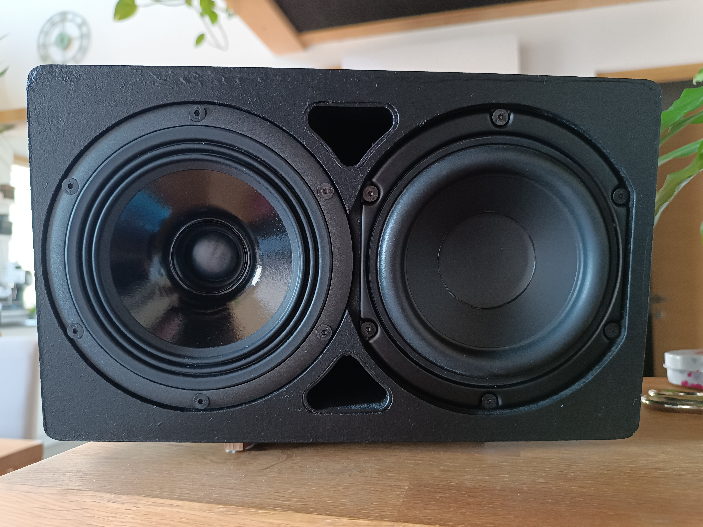

# Capabilities

A compact 302 x 218 x 184 mm speaker with linear frequency response and wide frequency range.
Frequency response linear __+-1.5dB down to 35Hz__ after dsp correction.
  
A 2 channel ADC converts the incoming Differential signals to an I2S stream, the RP2354 then acts as DSP and splits the I2S stream to 2 Amplifier chips with digital input,
so they have the DAC integrated.

Just connect the board to a pc, open a browser like chrome, and open the html, there is a connect button where you can select the board.
A SSD1306 and an Encoder form a gui to control simple functions, like input select, volume etc.

# Parts used

Speakers used:
* LF Drivers: Peerless SDS-135F25CP02-04
  https://loudspeakerdatabase.com/Peerless/SDS-135F25CP02-04
* Coaxial Drivers: SICA 5,5 C 1,5 CP
  https://loudspeakerdatabase.com/SICA/5,5C1,5CP

Electronics:
* 120W Gan power supply set to 24V - https://ko.aliexpress.com/item/1005011912930487.html
* ADC: TLV320ADC6120 - A high performance ADC with a snr of 123dB, and THD+N of -95dB and it can be controlled over i2c
  https://www.ti.com/lit/ds/symlink/tlv320adc6120.pdf?ts=1788514452765
* MCU: RP2354
* https://pip-assets.raspberrypi.com/categories/1214-rp2350/documents/RP-008373-DS-3-rp2350-datasheet.pdf
* AMP: 2x TAS5827 - Integrated I2S in Class D amplifier with 2x50W output. Also controllable via i2c. 
  https://www.ti.com/lit/ds/symlink/tas5827.pdf?ts=1788540720289&ref_url=https%253A%252F%252Fwww.ti.com%252Fproduct%252FTAS5827%252Fpart-details%252FTAS5827RHBR

# Usage
The UI lets you route the 2 inputs to the 4 outputs like you want.
Next part is the global EQ, that means it will be applied to all outputs.
Ideal for applying correction EQ for a Speaker system.
The UI also features an auto EQ function, where a REW file can be pasted and automatic filters are applied. 
Then individial filters can be applied to each of the 4 outputs, or their phase can be flipped.
At the end the main volume can be set.
Its not necessary to use this firmware, you can design your own.

As you may recognize the firmware and gui html was written with claude code.

the html with the ui: https://github.com/divadretniel-cyber/ESP32-DSP-Nearfield-Monitor/blob/RP2354_Control/USB-WEB-UI/WEB-UI.html

Drawing of the Speaker, the br ports and the volume for the coax speaker are 3D printed.

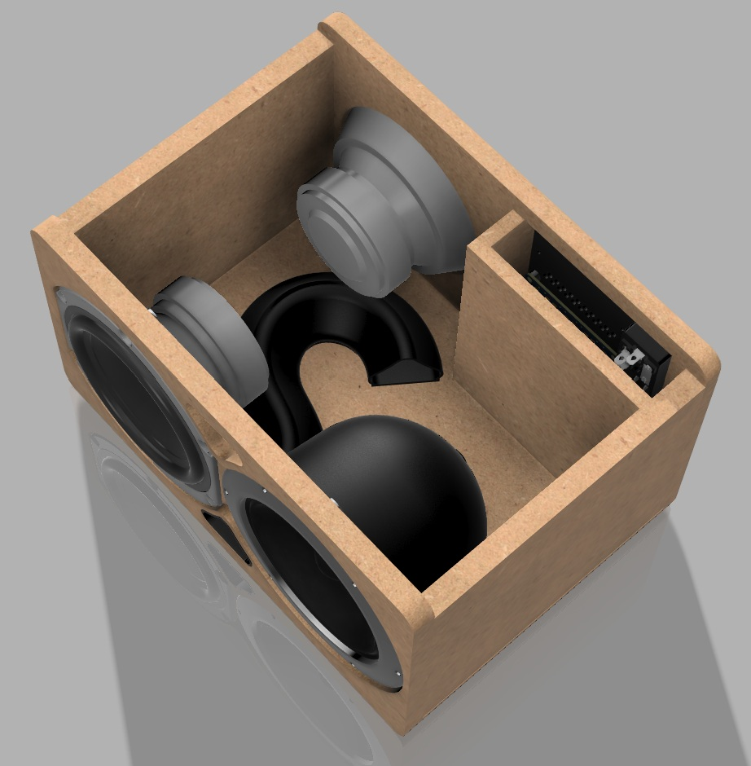.

Measurement after calibration:

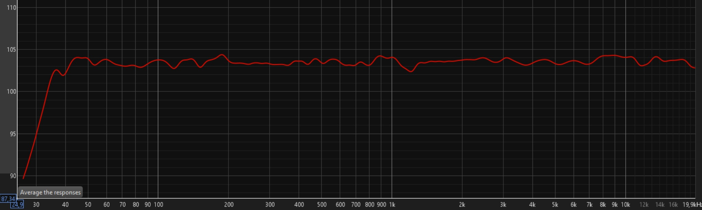

Construction was done in 14mm Mdf and printed parts.
The amplifier board is mounted on a 3mm aluminum plate, with a heat conductive pad between the board and the plate.
The drawing is in this repo and also the stl files for printing.

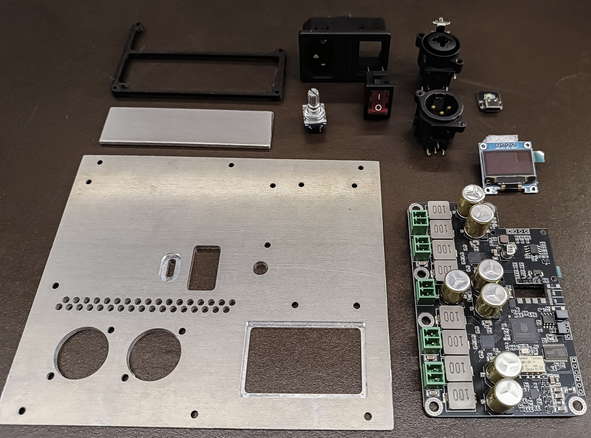

mounted parts:

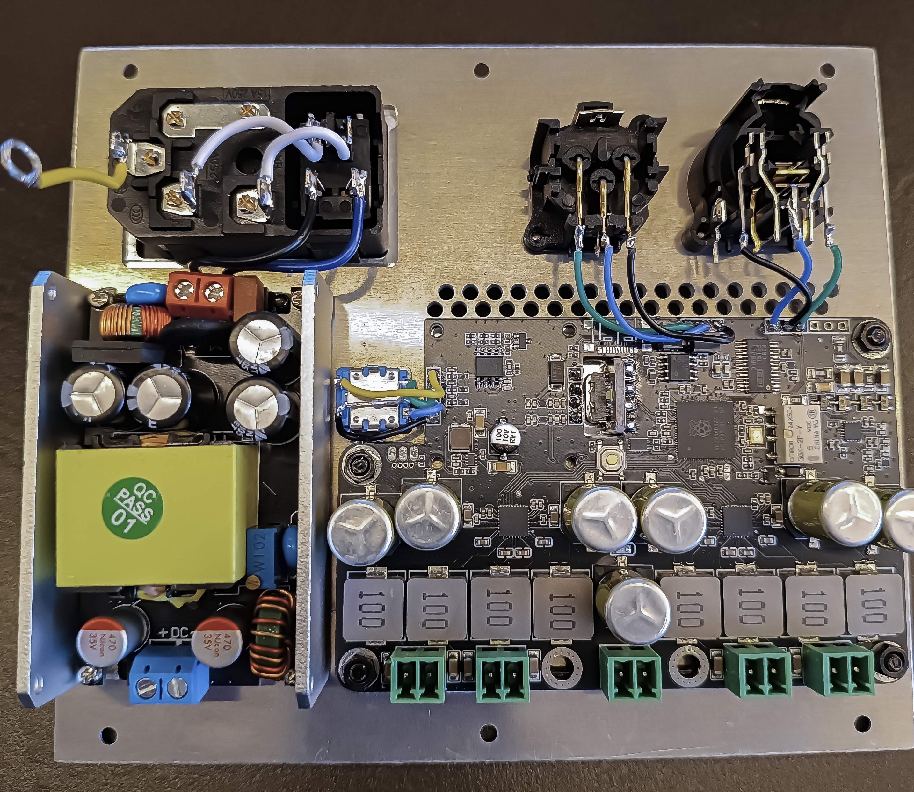

New UI:

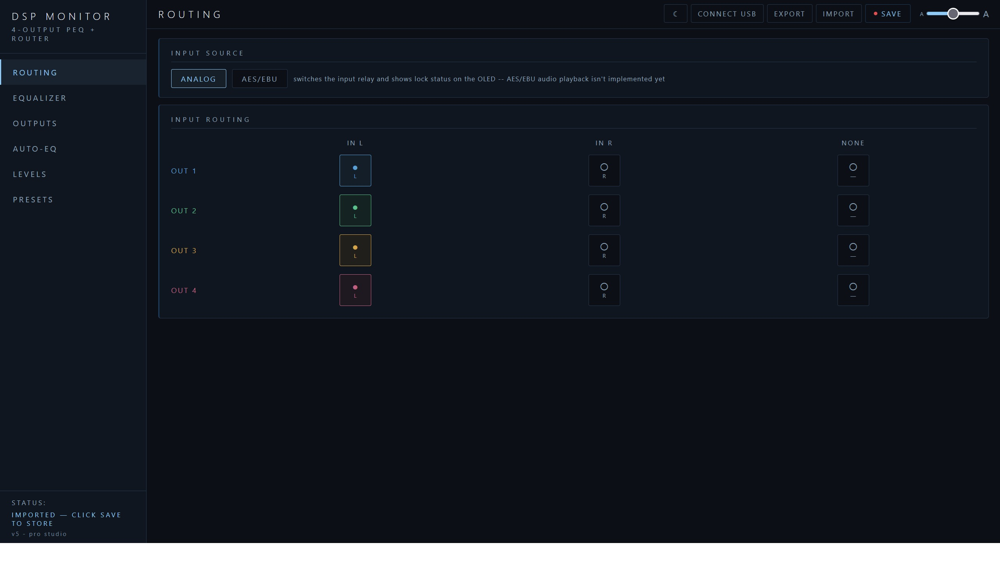

Main EQ:

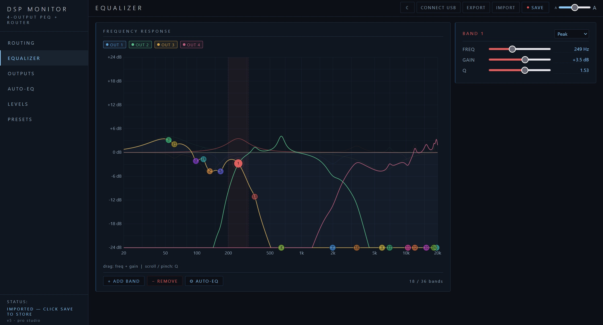

Auto EQ:

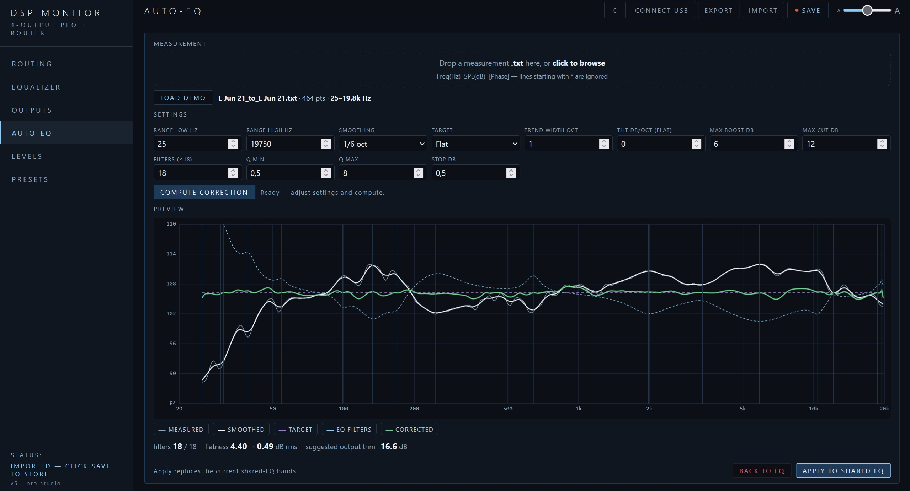#

Per channel EQ:

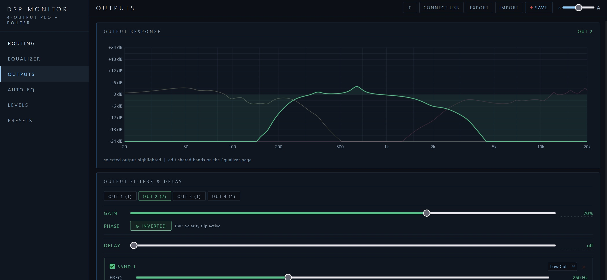

In/Out VU-Meter and Volume control:

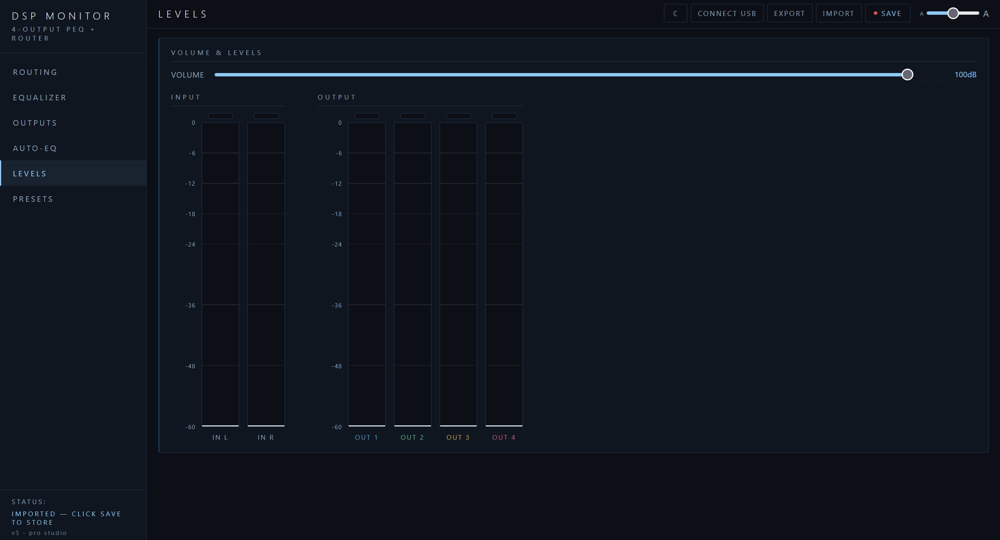

Presets:

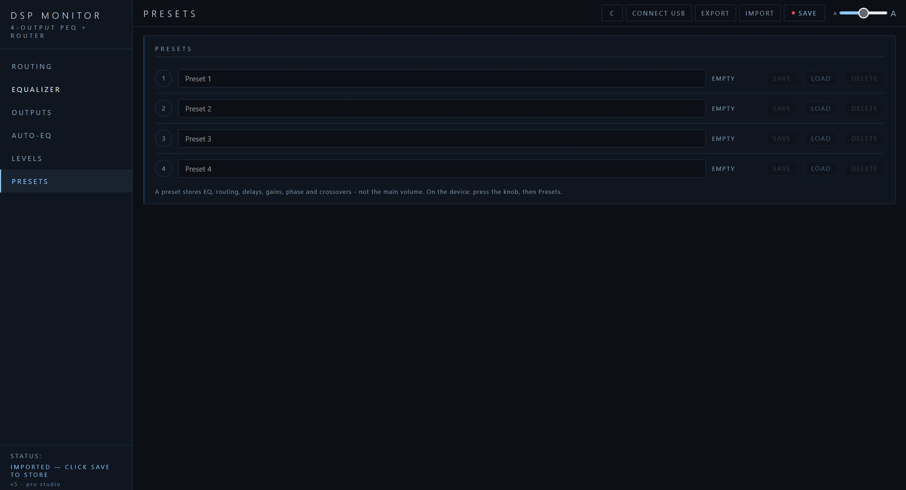

